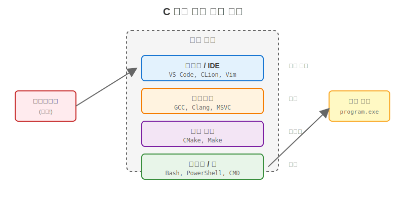
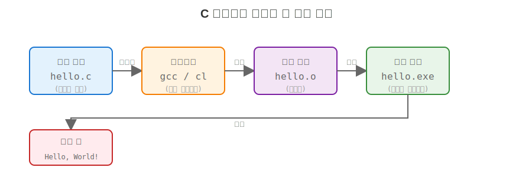
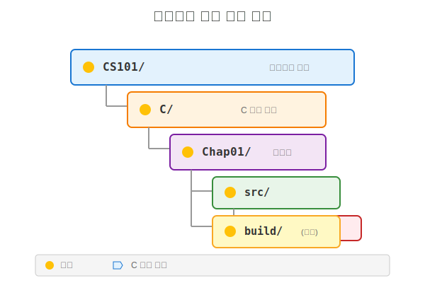

# C 언어 Chapter 1: 개발 환경 확인 및 첫 프로그램 (Hello, World)

## 두번째
### 세번째
---
페이지 나눔
- 아이템
- 두번째
  - 하나 아래
     - 그냥 쓰면 대충 다 맞습니다.
  - IDENT
- 잘 됩니다.


---

## 오늘 목표
- C 개발 환경이 무엇인지 이해한다
- 컴파일러/빌드 도구가 무엇을 하는지 안다
- 첫 C 프로그램을 작성하고 실행한다
- 기본적인 파일/폴더 구조를 익힌다

---

## 진행 순서
1. 개발 환경의 구성 요소
2. 필요한 도구 설치 확인
3. 첫 C 프로젝트 만들기
4. 컴파일과 실행 흐름
5. 실습과 체크포인트

---

## 개발 환경이란?
- 코드 작성 도구(편집기/IDE)
- 컴파일러(소스를 실행 파일로 변환)
- 빌드 도구(CMake 등)
- 실행 환경(OS/터미널)

---

## 개발 환경 구성도



---

## C 프로그램 실행 흐름



---

## 오늘 사용할 도구(예)
- VS Code: 코드 편집기
- 컴파일러: MSVC / GCC / Clang 중 하나
- 터미널: Windows Terminal 또는 기본 콘솔

---

## 설치 확인 체크
- VS Code 실행 가능
- 터미널에서 `gcc` 또는 `cl` 명령 확인
- C 파일을 저장할 폴더 준비

---

## 프로젝트 폴더 만들기
예시:
```
CS101/
  C/
    Chap01/
      hello.c
```

---

## 첫 번째 C 파일
`hello.c`

```c
#include <stdio.h>

int main(void) {
    printf("Hello, World!\n");
    return 0;
}
```

---

## 코드 해설 (핵심만)
- `#include <stdio.h>`: 입출력 함수 사용
- `main`: 프로그램 시작점
- `printf`: 화면 출력
- `return 0;`: 정상 종료 의미

---

## 컴파일 (GCC 예시)
```
gcc hello.c -o hello
```

---

## 실행 (Windows 예시)
```
hello.exe
```

---

## 컴파일 (MSVC 예시)
```
cl hello.c
```

---

## 실행 결과 확인
```
Hello, World!
```

---

## 빌드 오류를 읽는 법
- 첫 에러 메시지를 먼저 확인
- 파일 경로/줄 번호 확인
- 괄호/세미콜론 누락 체크

---

## 자주 발생하는 실수
- 파일 저장 안 함
- 확장자 `.c` 누락
- 컴파일 명령을 다른 폴더에서 실행

---

## 파일과 폴더 정리 규칙
- 소스는 `src/`
- 빌드 결과는 `build/` (선택)
- 프로젝트마다 폴더 분리

---

## 프로젝트 폴더 구조



---

## VS Code에서 빌드/실행
- 터미널 열기: `Ctrl + ``
- 현재 폴더에서 컴파일 명령 실행
- 필요하면 `tasks.json`으로 자동화

---

## 실습 1: 출력 바꾸기
요구사항:
- 출력 문장을 자신만의 문장으로 변경
- 이름을 포함해서 출력

---

## 실습 2: 줄바꿈 연습
요구사항:
- `\n`을 사용해 두 줄 출력
- 한 줄에 문장 두 개 출력해보기

---

## 실습 3: 파일 구조 정리
요구사항:
- `Chap01/src` 폴더 생성
- `hello.c`를 이동
- 컴파일 명령을 다시 실행

---

## 체크포인트
- 컴파일과 실행을 구분할 수 있나요?
- `main`의 의미를 설명할 수 있나요?
- 터미널에서 현재 위치를 확인할 수 있나요?

---

## 정리
- C 코드는 컴파일을 거쳐 실행된다
- 개발 환경은 편집기+컴파일러+터미널로 구성된다
- 간단한 폴더 구조를 유지한다

---

## 다음 시간 예고
- 변수, 자료형, 입출력
