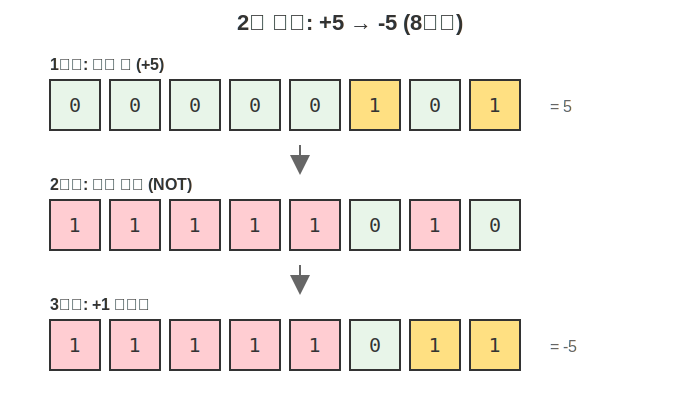
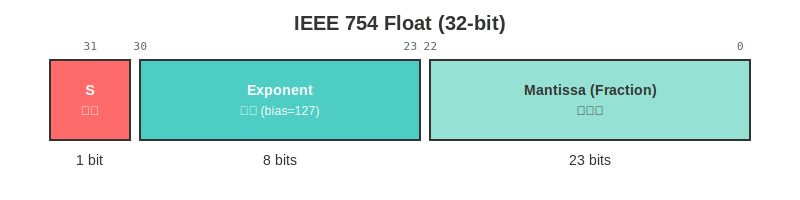
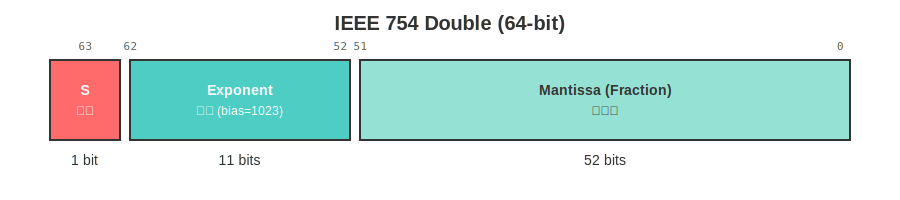

# C 언어 Chapter 3: 비트 연산과 자료형 심화

---

## 오늘 목표
- 비트 단위 연산을 이해한다
- 2의 보수로 음수를 표현하는 원리를 안다
- 부동 소수점의 내부 구조를 이해한다
- 오버플로우와 타입 캐스트를 다룬다

---

## 진행 순서
1. 비트 표현과 진법
2. 비트 연산자
3. 2의 보수
4. 부동 소수점 구조
5. 오버플로우
6. 타입 캐스트
7. 실습과 체크포인트

---

## 8진수/16진수와 비트 표현
- 8진수 1자리는 3비트와 1:1 대응
- 16진수 1자리는 4비트와 1:1 대응

```c
unsigned int x = 0xAF; // 0b1010_1111
unsigned int y = 017;  // 0b001_111
```

---

## 비트 연산자 기본
- `&` AND, `|` OR, `^` XOR, `~` NOT
- `<<` 왼쪽 시프트, `>>` 오른쪽 시프트

```c
unsigned int x = 0x0F;     // 0000 1111
unsigned int y = 0x33;     // 0011 0011
unsigned int z = x & y;    // 0000 0011
```

---

## 비트 마스크 예시
```c
unsigned int flags = 0;
flags |= (1u << 2);   // 3번 비트 켜기
flags &= ~(1u << 2);  // 3번 비트 끄기
```

---

## 시프트로 2의 거듭제곱 만들기
```c
unsigned int p2_0 = 1u << 0; // 1
unsigned int p2_3 = 1u << 3; // 8
unsigned int p2_5 = 1u << 5; // 32
```

---

## 비트 연산 활용 예시
- 플래그 관리 (여러 설정을 한 변수에 저장)
- 권한 체크
- 하드웨어 제어 (레지스터 조작)

---

## 2의 보수와 음수 표현
- 대부분의 시스템에서 정수 음수는 2의 보수 사용
- 음수 = 비트 반전 + 1

예시 (8비트):
- +5  = `0000 0101`
- -5  = `1111 1011`

---

## 2의 보수 다이어그램 (8비트, +5 -> -5)



---

## 2의 보수의 장점
- 덧셈/뺄셈을 같은 회로로 처리
- 0의 표현이 하나뿐 (0000 0000)
- 범위: -128 ~ +127 (8비트 기준)

---

## 부동 소수점 비트 표기(개념)
- IEEE 754 표준 사용
- `sign` + `exponent` + `fraction(=mantissa)`

예시 (float, 32-bit):
- 1비트 부호 + 8비트 지수 + 23비트 가수

---

## 부동 소수점 구조 다이어그램 (float, 32-bit)



---

## 부동 소수점 구조 다이어그램 (double, 64-bit)



---

## 부동 소수점 표현 방식
- 값 = (-1)^sign × 1.fraction × 2^(exponent-bias)
- bias: float는 127, double은 1023

예시:
- 3.14 ≈ 1.57 × 2^1

---

## 부동 소수점 비트 표기 주의
- 0.1 같은 값은 이진으로 무한 반복
- 저장 시 근사 → 누적 오차 가능

```c
double x = 0.1;
printf("%.17f\n", x); // 0.10000000000000001
```

---

## 특수 값
- Infinity (무한대): 지수 부분이 모두 1, fraction은 0
- NaN (Not a Number): 지수 부분이 모두 1, fraction은 0이 아님

```c
double inf = 1.0 / 0.0;  // Infinity
double nan = 0.0 / 0.0;  // NaN
```

---

## 오버플로우 개념
- 표현 가능한 범위를 넘으면 문제가 발생
- `unsigned`는 모듈러 연산처럼 감김(wrap)
- `signed`는 C에서 **정의되지 않음(UB)**

---

## unsigned 오버플로우 예시
```c
unsigned char x = 255; // 0xFF
x = x + 1;             // 0으로 감김
```

---

## 실습: 오버플로우 관찰
요구사항:
- `unsigned char`에 254, 255, 256을 출력
- `int`와 `unsigned int`의 최대값도 출력

힌트:
```c
#include <limits.h>
printf("%u\n", UINT_MAX);
```

---

## signed 오버플로우 예시 (주의)
```c
int x = 2147483647; // INT_MAX
x = x + 1;          // 동작이 보장되지 않음
```

> 컴파일러 최적화에 따라 예측과 다를 수 있음

---

## signed ↔ unsigned 캐스트
- 같은 비트 패턴을 다른 타입으로 해석

```c
int a = -1;
unsigned int b = (unsigned int)a; // 보통 모든 비트 1
```

---

## signed → unsigned 결과
- 비트는 그대로, 해석만 바뀜
- -1은 보통 `UINT_MAX`로 보임

```c
int a = -1;
printf("%u\n", (unsigned int)a); // 4294967295 (32-bit 기준)
```

---

## unsigned → signed 주의
```c
unsigned int a = 4294967295u; // UINT_MAX
int b = (int)a;                // -1 (대부분)
```

---

## mixed 연산 주의
- signed/unsigned가 섞이면 unsigned로 승격되는 경우가 많음

```c
int a = -1;
unsigned int b = 1;
if (a < b) { /* 기대와 다를 수 있음 */ }
```

---

## 비트 연산 실용 예시: 플래그
```c
#define FLAG_READ  (1u << 0)  // 0001
#define FLAG_WRITE (1u << 1)  // 0010
#define FLAG_EXEC  (1u << 2)  // 0100

unsigned int perms = FLAG_READ | FLAG_WRITE;
if (perms & FLAG_WRITE) {
    printf("쓰기 권한 있음\n");
}
```

---

## 비트 연산 실용 예시: 색상
```c
// RGB를 하나의 int로 저장
unsigned int color = 0x00FF8800; // RRGGBB
unsigned int r = (color >> 16) & 0xFF; // 0xFF
unsigned int g = (color >> 8) & 0xFF;  // 0x88
unsigned int b = color & 0xFF;         // 0x00
```

---

## 실습 1: 비트 마스크
요구사항:
- unsigned int에 3번, 5번 비트 켜기
- 결과를 16진수로 출력

---

## 실습 2: 비트 카운트
요구사항:
- unsigned int에서 1인 비트 개수 세기
- 반복문과 비트 연산 사용

힌트:
```c
while (n) {
    count += n & 1;
    n >>= 1;
}
```

---

## 실습 3: 타입 캐스트 관찰
요구사항:
- int a = -1을 unsigned int로 캐스팅
- 결과를 %d와 %u로 각각 출력

---

## 체크포인트
- 비트 연산자의 용도를 설명할 수 있나요?
- 2의 보수로 음수를 표현하는 방식을 이해했나요?
- 부동 소수점의 기본 구조를 설명할 수 있나요?
- 오버플로우 위험을 인식하고 있나요?

---

## 정리
- 비트 연산은 플래그, 색상, 권한 관리에 유용
- 2의 보수는 음수 표현의 표준
- 부동 소수점은 근사값이므로 주의가 필요
- 오버플로우와 타입 캐스트는 신중히 다뤄야 함

---

## 다음 시간 예고
- 연산자와 표현식
